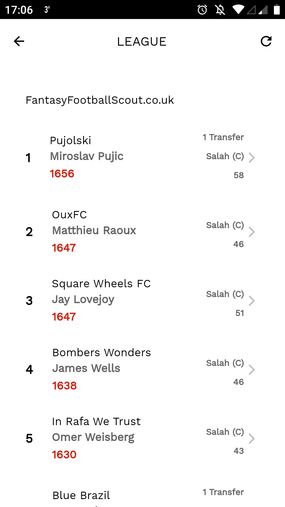

 
<h2 align="center"><b>Fantasy Football Live</b></h2>
<h4 align="center">An Ionic 4 hybrid application for use with the offical Fantasy Premier League game.</h4>

## App Store
  

## Screenshots

## Description
Fantasy Football Live uses the Offical FPL API (Links can be found [here](https://github.com/pkgrem/OddsOnFPL)) to get the latest team data and scores. All that is needed is your team's FPL ID, which can be found in the URL when in the points tab of your team on the Offical Fantasy Premier League site.

### Features
* Live Leagues
* Live Team Viewer
* Gameweek Transfers made
* Player Fixture Difficulty
* Fixture Difficulty Ranking with a variable gameweek selector
* Latest news articles

## Contribution
If you have any ideas, suggestions, design changes, code refactoring or big code changes, help is always appreciated!

If you'd like to get involved, check our [contribution notes](CONTRIBUTING.md).

## Donate
If you like using FFL a donation is always appreciated. So if you want to buy me a coffee :coffee: or beer :beer: please use one of the links below :heart:

<table>
  <tr>
    <td></td>
    <td></td>
    <td><samp>bc1qsqac863n0yc4mc0c8zk0mxwx3qymhc0pxjp9wm</samp></td>
  </tr>
  <tr>
    <td></td>
    <td></td>
    <td></td>
  </tr>
</table>

## License
  

Fantasy Football Live is Free Software: You can use, study share and improve it at your
will. Specifically you can redistribute and/or modify it under the terms of the
[GNU General Public License](https://www.gnu.org/licenses/gpl.html) as
published by the Free Software Foundation, either version 3 of the License, or
(at your option) any later version.  
